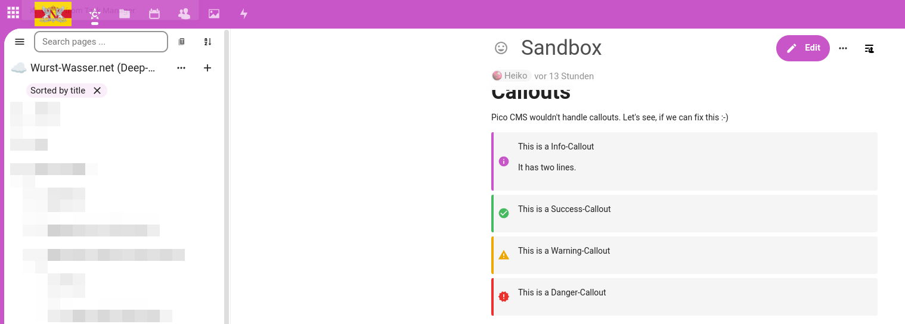
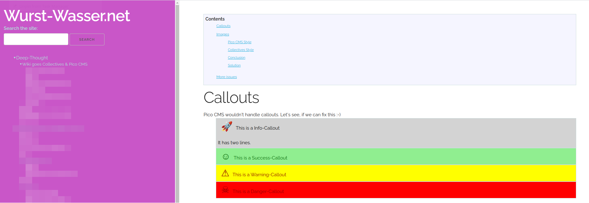

# CollectivesCallouts
## Description
A Pico CMS-Plugin that allows styling of Nextcloud Collectives Callouts

## Installation
- Copy CollectivesCallouts-folder to Pico CMS plugins folder (usually in ./plugins in pico-root).
- Add the style sheet to your theme:
''''
<link rel="stylesheet" href="{{ plugins_url }}/CollectivesCallouts/style.css">  
''''

## More
More ideas about using Nextcloud Collectives as backend for Pico CMS can be found here: TBD

# Example
## How it looks in Nextcloud Collective

## How it looks in Pico CMS
You can change the design by changing style.css.

